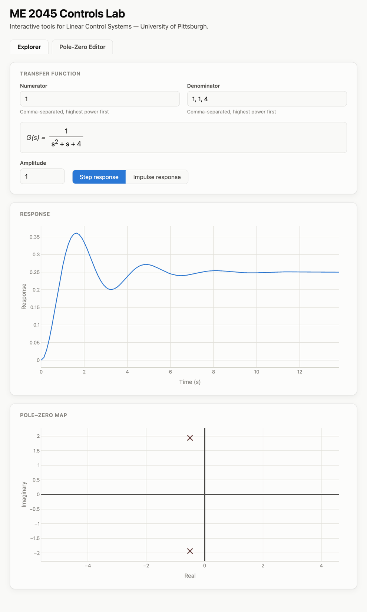

# ME 2045 Controls Lab

An interactive teaching and learning tool for **ME 2045 – Linear Control
Systems** at the University of Pittsburgh — a growing collection of
hands-on tools built up over the course of the semester, not a single
fixed demo.

Right now: type in a transfer function (or click a preset) and see its
step/impulse response, performance metrics, pole–zero map, and modal
decomposition update live. Other tabs let you build a system by clicking
poles and zeros directly onto the s-plane, sweep a 2nd-order system's ζ
and ωn, or sweep the gain on a **root locus** and watch the closed-loop
poles travel toward instability. New tools get added as the class
progresses.



## The Tabs

**Explorer** — type a transfer function (or click a preset) and get the
step or impulse response with rise time, settling time, overshoot, peak,
and steady-state value, alongside a live pole–zero map, a stability
classification (stable / marginally stable / unstable), and a
decomposition of the response into its individual modes.

**Pole-Zero Editor** — build a system the other way round: click poles and
zeros directly onto the s-plane, adjust the gain, and read off the
transfer function and response that result. Points placed off the real
axis get their conjugate partner automatically.

**2nd-Order System** — sweep damping ratio ζ and natural frequency ωn on
the canonical form *G(s) = ωn² / (s² + 2ζωn·s + ωn²)* and watch the poles
and the step response move together, with the regime (undamped,
underdamped, critically damped, overdamped) named as you go. The axes stay
fixed while you drag, so you're comparing the curves themselves rather
than a rescaling plot.

**Root Locus** — enter the open-loop poles and zeros of the loop gain,
then sweep K to watch the closed-loop poles travel along the branches
while the closed-loop step response follows. Overlays draw the sketching
rules — real-axis segments, asymptotes and centroid, breakaway points, and
the jω crossing with the maximum stable gain — so a hand sketch can be
checked against the real thing. Clicking any point in the s-plane tests it
against the angle criterion: a vector is drawn from every pole and zero,
each distance and angle is tabulated, and the tool reports whether the sum
lands on 180°.

**Compensator Design** — work the classical cascade-compensation problem
end to end. Give it a plant, a percent-overshoot spec and a target
settling time, and it finds where proportional control puts you now,
where the spec says you want to be, and how much phase the plant is short
at that point. Then place a **PD** compensator (a lone zero, whose
location is forced — one unknown, one angle equation) or a **lead**
compensator (drag the zero and watch the pole solve itself). The locus
before and after are drawn together, along with the two step responses,
so a halved settling time at unchanged overshoot is visible at a glance.

Everything runs locally with a light/dark theme, no build step, and no
external accounts.

## Tutorial: Run It on Your Own Machine

You're encouraged to **fork this repository to your own GitHub account**
and follow along below — this is the best way to keep your own copy,
experiment freely, and (if you want) track your changes with git.

### 1. Fork the repository

Click **Fork** in the top-right corner of this repo's GitHub page, and
fork it into your own account.

### 2. Clone your fork

```bash
git clone https://github.com/<your-username>/Pitt-ME2045.git
cd Pitt-ME2045
```

### 3. Check your Python version

You'll need **Python 3.9 or newer**.

```bash
python3 --version
```

### 4. (Recommended) Create a virtual environment

Keeps this project's dependencies separate from everything else on your
machine.

```bash
python3 -m venv .venv
source .venv/bin/activate        # Windows: .venv\Scripts\activate
```

### 5. Install dependencies

```bash
pip install -r requirements.txt
```

### 6. Run the app

```bash
python app.py
```

### 7. Open it in your browser

Go to **http://localhost:5000**.

> **macOS note:** if you see "Address already in use," macOS's AirPlay
> Receiver is likely using port 5000. Either turn it off (System
> Settings → General → AirDrop & Handoff), or run on a different port:
> `python -c "from app import app; app.run(port=5050)"` and open
> `http://localhost:5050` instead.

### 8. (Optional) Run the tests

Confirms your setup is working correctly.

```bash
pytest test_app.py -v
```

## Notes

- In the Explorer, numerator/denominator coefficients are entered highest
  power first, comma-separated (e.g. `1, 1, 4` for `s^2 + s + 4`).
- In the Root Locus tab, poles and zeros are entered in factored form
  instead — as a list of locations (e.g. `-1, -2, -3, -4`). Complex
  entries are written `-1+1j`, and `-1±1j` is shorthand for the whole
  conjugate pair.
- The Root Locus tab assumes **unity feedback**: what you enter is the
  loop gain *L(s) = G(s)H(s)*, the closed-loop poles are the roots of
  *1 + K·L(s) = 0*, and the plotted response is *K·L / (1 + K·L)*.
- Unstable and marginally-stable systems are simulated over a capped time
  window sized to the system's own dynamics, and performance metrics
  (rise time, settling time, etc.) aren't shown, since they aren't
  well-defined for a response that never settles.

## License

MIT — see [LICENSE](LICENSE). Free to use, fork, and modify for coursework,
teaching, or your own learning.
